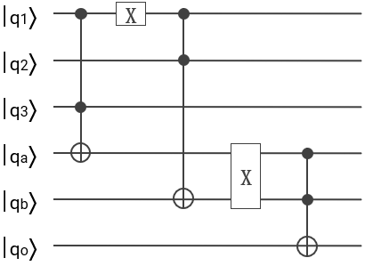

# quantum_computing
All the code is under NDA and can't be disclosed.
Below a description of the challenges and solutions.

## Quantum Prime Number Detector Challenge

Design and implement a quantum circuit that can reliably detect the prime
numbers using only primitive gates.

For example in the range [0, 7] (i.e 2, 3, 5 and 7) the truth table was: 

| a  | b  |  c |   |
|---|---|---|---|
| 0 |  0 |  0 | No |
| 0  | 0  |  1 | No |
|  0 |  1 |  0 | Prime |
|  0 |  1 |  1 | Prime |
|  1 | 0  | 0 | No |
|  1 |  0 |  1 | Prime  |
|  1 |  1 |  0 | No |
|  1 |  1 |  1 | Prime |

With the following logic:

(a AND c) OR (NOT(a) AND b)

And classic circuit diagrama:

Translating this into a quantum computing diagram: 

Which receives a 3-qbit input register enconding the input value in the range of [0,7] and returns a 1-qubit reguster set to value |1> if the input is prime, or |0> otherwise.

## Quantum Portfolio risk detector

A trader has a portfolio of 65,536 assets (16 qubits), each of which has a risk assesment simply stated as "high" or "low". To balance the portfolio the ideal position is to have an equal number of assets assessed as high and low risk. 

The solution was to build an algorithm that retrieves 1 if the trader's portfolio is risk-balanced, o otherwise.

Such algorithm replicated the < a href = "https://www.quantiki.org/wiki/deutsch-jozsa-algorithm" > Deutsch–Jozsa algorithm  </a>. 

Definition: In Deutsch-Jozsa problem, we are given a black box computing a 0-1 valued function f(x1, x2, ..., xn). The black box takes n bits x1, x2, ..., xn and outputs the value f(x1, x2, ..., xn). We know that the function in the black box is either constant (0 on all inputs or 1 on all inputs) or balanced (returns 1 for half the domain and 0 for the other half). The task is to determine whether f is constant or balanced.

